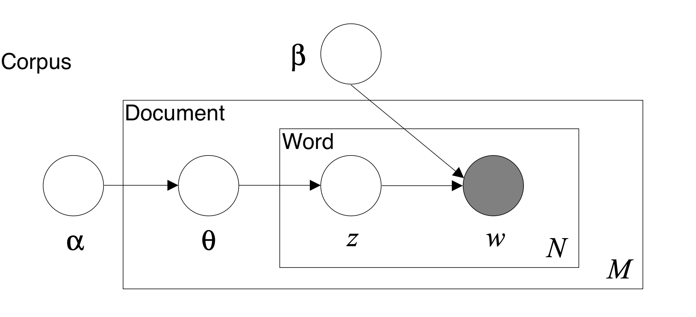
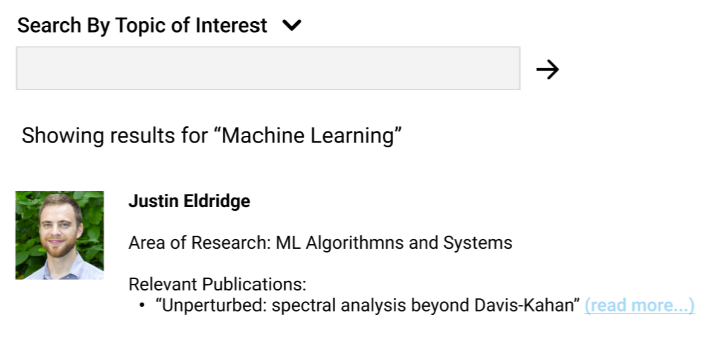

# HDSI Faculty Exploration Tool

Team Members: Sijie Liu, Siddhi Patel, Brian Qian, Du Xiang

<a href="https://docs.google.com/document/d/1u6r-X8ZCbjC8UuSJau-DIbpBevjOWTVSEwI4qaLCmlI/edit?usp=sharing">See our Report</a>

<a href="https://github.com/IreneLiu2018/capstone_a14/tree/master/New_Vis">Our Project GitHub Repo</a>

## Our Goal 

The <a href="https://datascience.ucsd.edu/">Halıcıoğlu Data Science Institute (HDSI)</a> at University of California, San Diego is dedicated to the discovery of new methods and training of students and faculty to use data science to solve problems in the current world. The HDSI has several industry partners that are often searching for assistance to tackle their daily activities and need experts in different domain areas. Currently, there are around 55 professors affiliated to HDSI. They all have diverse research interests and have written numerous papers in their own fields. 

Our goal was to create a tool that allows HDSI to select the best fit from their faculty, based on their published work, to aid their industry partners in their specific endeavors. We did this with Natural Language Processing (NLP) by managing all the abstracts from the faculty’s published work and organizing them by topics. We will then obtained the proportion of papers of each faculty associated with each of the topics and drew a relationship between researchers and their most published topics. This will allow HDSI to personalize recommendations of faculty candidates to their industry partner’s particular job.
 
 
 
## Our Dashboard

We have created a tool that allows for future users to explore faculty's work in a very easy and intuitive way. <a href="https://github.com/IreneLiu2018/capstone_a14/tree/master/New_Vis">Our Project GitHub Repo</a> gives detailed instructions on how to run the dashboard.

Once you are able to get the address for the dashboard and copy and paste it on your browser, you should see something like the following:

This dashboard includes a Sankey Diagram, a number of topics selection bars, and 3 different search bars on the right for topic number and topic words, researcher and keywords.

The topics were obtained using a  <a href="#Latent Dirichlet Allocation (LDA)"> Latent Dirichlet Allocation (LDA) </a> topic model. 

On the bar on the left, you are able to select the number of topics you wish to see and that were generated by LDA.

On the Topic number bar, you are able to see the topic number along with its associated top words and the related field labels that we have added. 

You are also able to select a particular researcher and all of their published papers will appear along with the topic number they are related too.

A word search can also be done and the related topics will show up as well.

## Data Collection

In order to obtain abstracts from HDSI faculty's publications, we used <a href = 'https://datanexus.ucsd.edu/analytic-data/dimensions.html'> Dimensions'</a> API. This website contains publications and academic journal articles and with their API we were able to obtain HDSI faculty researcher profiles.

We then obtained all of the abstracts available from these authors. For additional information not found on Dimensions, we utilized Google Scholar profiles. We complemented the data with both of these sites.

In our dashboard, you are able to select a particular author and if their Google Scholar profile has labels for their Field or Concentration, these will be displayed as shown on the image below. This makes it easier for the user to be more familiar with the author's work. 

## Abstracts as Data
We considered the use of abstracts as our main source of data since in scientific papers and publications, abstracts are a short summary of a completed research. After further exploration and topic modeling, we discovered that they are indeed representative of the author's general field.

It is important to mention that even though researchers might not use the exact words 'Machine Learning' on their abstract, our model detects words that are associated with the topic and the relationship between them and the field can be easily inferred. For added precision, we have added Related Field labels next to the words generated by the model.

  
## <a id="Latent Dirichlet Allocation (LDA)">Latent Dirichlet Allocation (LDA)</a>

Topic modeling provides methods for automatically organizing, understanding, searching, and summarizing large text corpora.

Latent Dirichlet Allocation (LDA) was used for our topic modeling. The LDA model can be represented by a graphical probabilistic model with three levels as shown in the following figure. The inner level represents the word level: **w** denotes a specific word in a particular document, while **z** denotes the specific topic sampled for that particular word. At the document level, **Θ** represents the topic distribution for a particular document. At the outer corpus level, **α** and **β** represents the document topic density and the word topic density, respectively.  LDA uses a generative probabilistic approach to model each topic as a mixture of a set of words and each document as a mixture of a set of topics.

Behind the scene, the LDA model takes the corpus of texts with the id2word indexes and transform them into document topic density matrix and word topic density matrix by repetitive probabilistic sampling. The document topic density matrix contains the **D** number of documents as rows, and **K** number of topics as columns. Each row represents the particular probability distribution over the generated topics for that particular document/article. The word topic density matrix contains **V** rows of unique words, and **K** as the number of columns. Then, each row of the matrix represents a probability distribution of topics for a particular word. With the two matrices, we are able to generate a list of top terms for each topic ranked by the probability distribution. And also we could extract the dominant topics for each terms by the measures in the document topic density matrix. 

As a result, by running the LDA model, we will be able to obtain several matrices: the word-topic matrix which represents each word with its associated topic distribution, the document-topic matrix which represents each document with its corresponding probability score, the author-topic matrix which aggregates from the document-topic matrices by the authors and the author-year-topic matrix which is obtained by aggregate further from author-topic matrix by year.

The difficulty lies in the choice of **K**, the number of generated topics. Because this is a unsupervised machine learning method, it requires human interpretation to account for the qualities of generated topics. We will be choosing the topics by running different **Ks** individually and compare results together.

## Topic Labelling
We obtained labels from LDA model, Google Scholar and Dimensions to categorize articles and faculty

- LDA: we used the labels from our trained LDA model to represent our topics. 
- Google Scholar: we scraped the labels for each researcher from their Google Scholar pages. 
- Dimensions API: we gathered labels from Dimensions API and combined them with the LDA labels to optimize our labels for topics. 

## Maintaining a Workflow

As our tool aims to provide the information of faculty members at HDSI to facilitate the partnership with the industry, we hope that this tool can be always stay updated and robust to changes. Therefore, we designed a data pipeline that enables updates for our search tool:

- Data ETL: This part is done through an API call to the Dimensions database to extract the latest faculty publication data.
- Data Preprocess: This is the first part of data pipeline which cleans up the retrieved datasets and preprocess for the later modeling use.
- LDA Modeling: The second part of the pipeline is dedicated to the modeling process. Here, developers can modify the configuration to adjust the topic models and explore the topic results.
- Prepare Dashboard: Based on the selected models, the pipeline will run the appropriate models and generate the necessary files for the use of dashboard.
- Launch Dashboard: Once all the data and files are ready, the dashboard is ready to be launched.

This workflow can be traced in our Github repo, and our goal is to run through the pipeline once a year so that the latest information can be reflected on the dashboard.

## Easy Search Tool and Future Work

While our current dashboard has many useful functions that can offer great use cases for our Industry partners, we also wanted to imagine how we could integrate a more UI focused easy search tool on the HDSI website. So we created a <a href="https://www.figma.com/proto/WO5QJnJrALVwI2xu1NfgAg/Main?node-id=28%3A2&starting-point-node-id=28%3A2">Figma demo</a> demonstrating the features that we are further interested in exploring and testing for a broader target audience including those who many not be familiar with more advanced data visualizations like the sankey diagram.

Thus our faculty exploration tool resembles a search bar like aesthetic that matches the current theme of the HDSI website with modern UI aspects and a navy and gold color scheme. The search bar tool will be helpful to explore the array of topics that each of our HDSI faculty members specializes in from microbiology to machine learning algorithms similar to the search by keyword function within our current dashboard. 

However our concept further extends to how we want our information to be displayed. So by adding profile pictures that coincide with each faculty member’s name, area of research, and their most relevant publications, our goal is to create a more intuitive layout that provides a greater amount of information within a quick glance. In addition, we also imagined a profile style page that expands upon each faculty member’s publications, abstracts, along with their article level topic, and contact information for easy access to the user. While this is still a work in progress, our next steps would be to further build upon the early stages of implementation using Html and RxJs with a future goal of integrating our faculty exploration tool on the HDSI website itself which would allow a wider audience to find suitable faculty members depending on what their specific needs are.

